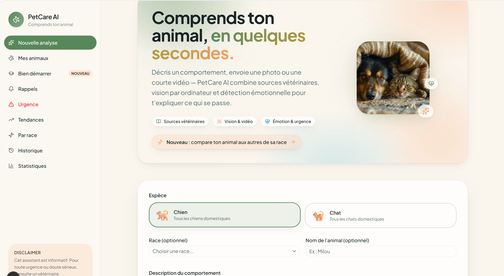
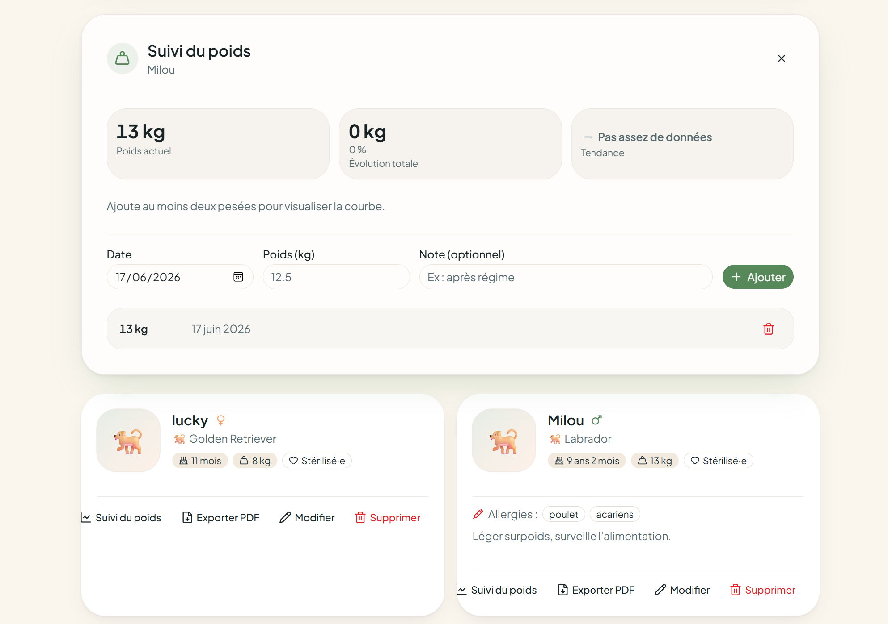
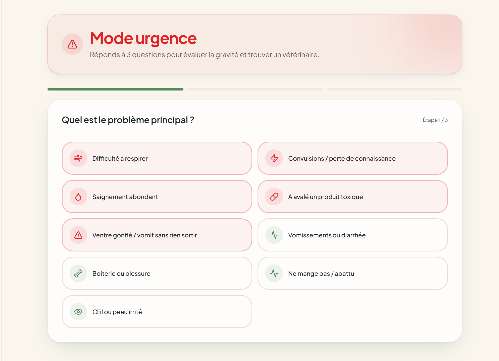

# PetCare AI

Une application qui analyse le comportement des animaux de compagnie (chiens et chats) pour aider leurs propriétaires à mieux les comprendre.

On décrit le comportement de son animal — par texte, photo ou courte vidéo — et l'application répond en s'appuyant sur des sources vétérinaires. Elle gère aussi un carnet de suivi : fiche santé, poids, rappels de soins et export d'un dossier pour le vétérinaire.

## Captures

Accueil — analyse du comportement :



Carnet de l'animal et suivi du poids :



Mode urgence — triage en 3 questions :



## Fonctionnalités

- Analyse du comportement par texte, photo ou vidéo
- Détection de l'émotion et du niveau d'urgence (vert / jaune / orange / rouge)
- Réponses basées sur une base de connaissances vétérinaire (RAG)
- Fiche complète de l'animal : âge, poids, vaccins, allergies, notes
- Suivi du poids avec courbe et alerte en cas de variation anormale
- Calendrier de rappels (vaccins, vermifuges, visites)
- Export du dossier vétérinaire en PDF
- Mode urgence avec triage rapide
- Guide pour les nouveaux propriétaires

## Stack

- **Frontend** : Next.js, React, TypeScript, Tailwind CSS
- **Backend** : FastAPI, SQLAlchemy, SQLite
- **IA** : LangChain + ChromaDB pour le RAG, modèles Groq (Llama) pour le texte et la vision, OpenCV + MediaPipe pour la vidéo

## Installation

Il faut Python 3.13+, Node.js 20+ et une clé API Groq (gratuite).

### Backend

```powershell
git clone https://github.com/Nour911x/PetCare-AI.git
cd PetCare-AI

py -m venv venv
.\venv\Scripts\Activate.ps1
pip install -r requirements.txt

copy .env.example .env
```

Ajoute ta clé Groq dans le fichier `.env`, puis construis la base de connaissances :

```powershell
py -m src.ingest
```

Lance l'API :

```powershell
uvicorn backend.main:app --reload
```

L'API tourne sur http://localhost:8000.

### Frontend

Dans un autre terminal :

```powershell
cd frontend
npm install
npm run dev
```

L'application est sur http://localhost:3000. Le backend et le frontend doivent tourner en même temps.

## Remarque

PetCare AI est un outil d'information, pas un avis vétérinaire. En cas de doute ou d'urgence, il faut consulter un vétérinaire.
